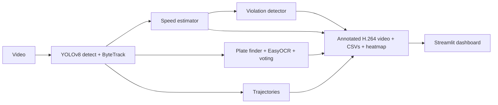

# 🚦 IntelliTraffic AI

AI-powered traffic surveillance and analytics: **YOLOv8 + ByteTrack + EasyOCR + OpenCV + Streamlit**.
Detects and tracks vehicles, estimates speed, reads licence plates, flags overspeeding, and ships a
research toolkit for evaluating each stage.

Live demo: https://intellitraffic-ai.streamlit.app/

## Features
- Vehicle detection (car, motorcycle, bus, truck only) with YOLOv8
- Multi-object tracking with ByteTrack (BoT-SORT selectable)
- Speed estimation: simple metres-per-pixel or 4-point homography calibration, smoothed
- Licence-plate localisation + EasyOCR + Indian-plate-aware cleanup + multi-frame voting
- Overspeed detection (N consecutive frames above the limit) with offender snapshots
- Trajectory trails, trajectory CSV and heatmap
- Dashboard: live progress, KPIs, charts, violations, plate search, trajectories, video, downloads
- Browser-playable H.264 output video
- Research scripts: detection, tracking, speed, OCR, ablation, benchmark

## Architecture


## Project layout
```
app/        config, detection, tracking, speed, ocr, violations, trajectory, analytics, pipeline, utils
research/   evaluation + ablation + benchmark scripts (see research/README.md)
tests/      pytest suite (runs without torch)
configs/    config.yaml
app.py      Streamlit dashboard        main.py   CLI
```

## Install & run locally
```bash
python -m venv .venv && source .venv/bin/activate      # Windows: .venv\Scripts\activate
pip install -r requirements.txt
streamlit run app.py                                   # dashboard
python main.py --input videos/traffic.mp4 --speed-limit 50 --mpp 0.04   # headless
pytest                                                 # tests
```
Outputs (in `outputs/`): `final_output.mp4`, `vehicle_records.csv`, `violations.csv`, `trajectories.csv`,
`speed_timeline.csv`, `trajectory_heatmap.png`, `run_metadata.json`, `snapshots/`.

## ⚠️ Calibrate speed or the numbers are meaningless
Speed = real distance / time, so the camera must be calibrated.
- **Simple:** measure a known road length (e.g. a 3 m lane-marking gap) and divide by its length in pixels → `meters_per_pixel`. Only accurate for a roughly top-down view.
- **Homography (recommended):** pick 4 road-plane points in the image (e.g. lane-line corners) and enter their real-world coordinates in metres. Corrects perspective.

## Deploy on Streamlit Community Cloud
1. Push this project to a **public GitHub repo** (`app.py` at the repo root).
2. Go to https://share.streamlit.io → **Create app** → pick the repo, branch `main`, main file `app.py`.
3. Open **Advanced settings** → choose **Python 3.11**.
4. Click **Deploy**. The first build takes 5-10 minutes (installs torch CPU, ultralytics, easyocr).
5. On first analysis the YOLO weights (and EasyOCR models) download automatically; this takes a minute.

Tips: use short clips (or set "Max frames"), the `yolov8n` model, and consider turning OCR off if the app
runs out of memory (free tier is ~2.7 GB RAM). Optional demo data: `git add -f outputs/final_output.mp4 outputs/vehicle_records.csv ...`
so the dashboard has content on load.

## Roadmap
Lane detection, accident detection, webcam/RTSP input, congestion prediction, cloud DB, multi-camera.

Author: Samridhi Kulshrestha · https://github.com/sam-coolshrestha
